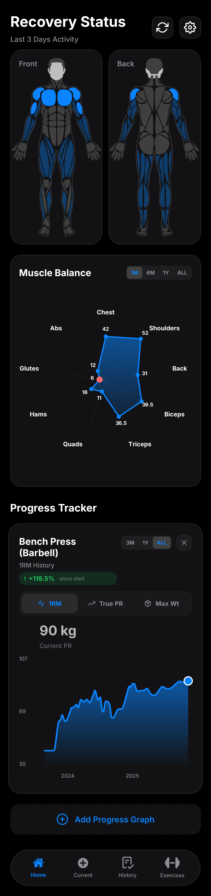

# **Sisyphus** 💪📊

**Sisyphus** is an Android fitness tracking app focused on **strength progression**, **muscle growth**, and **recovery**.  

---

## **Features**

### 🧠 **Recovery Status**
- Front & back muscle maps  
- Highlights muscles trained in the **last 3 days**
- Quick visual fatigue check

### ⚖️ **Muscle Balance**
- Radar chart per muscle group  
- Time filters: **1M / 6M / 1Y / ALL**
- Spot overuse and neglected muscles instantly

### 📈 **Progress Tracking**
- Exercise-specific strength graphs  
- **1RM estimation**
- Track PRs and % growth over time  

### 🏋️ **Exercise History**
- Log exercises and sessions  
- View historical performance per lift  

---

## **Tech Stack**

- **React Native / Expo**
- **JavaScript**


## Screenshots

<p align="center" style="display: flex; flex-wrap: nowrap; justify-content: center; gap: 12px; overflow-x: auto;">
  
  
  
  
  
</p>

---

## **Getting Started**

```bash
git clone https://github.com/elliottRF/Sisyphus.git
cd Sisyphus
npm install
npm start
