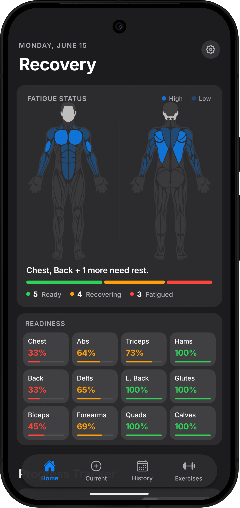
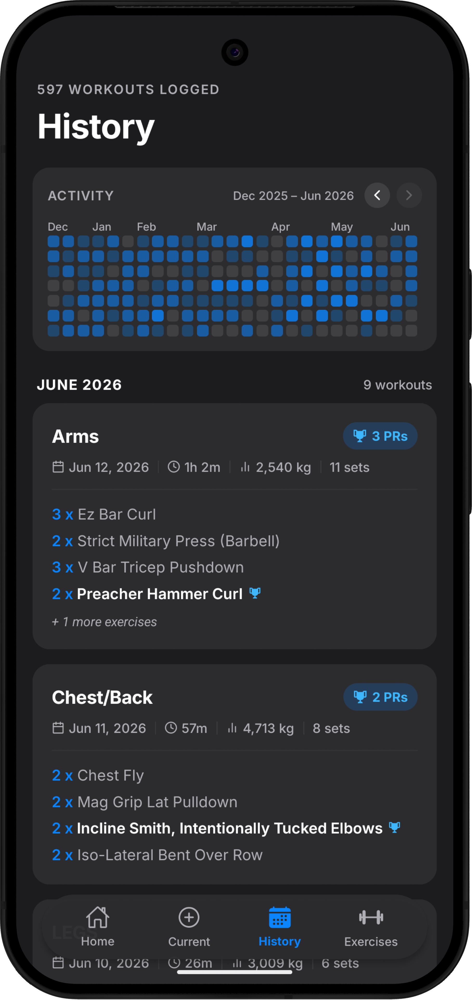
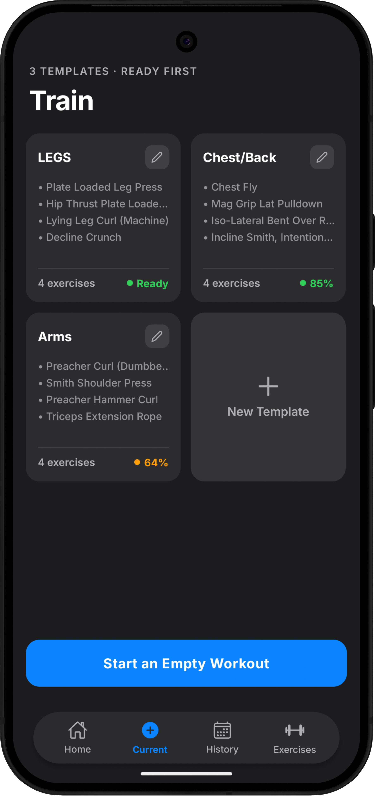
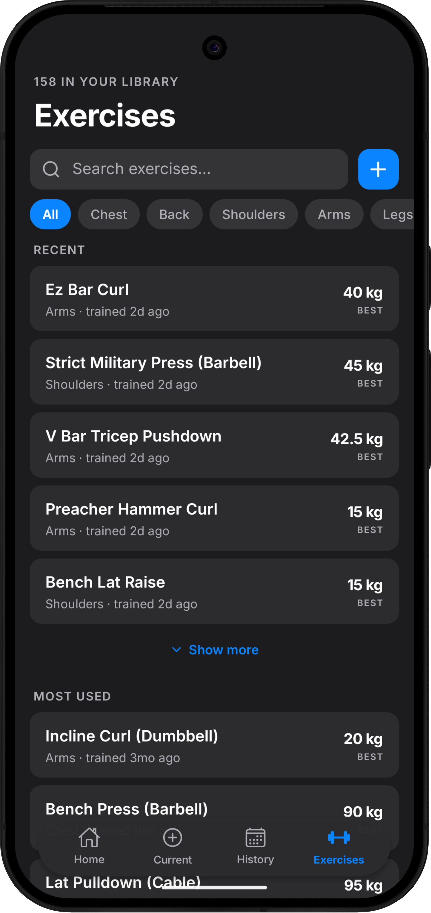

# Sisyphus – Gym Progress Tracker

Sisyphus is an Android app for tracking workouts and monitoring long-term strength progression.
> Android only – no iOS build currently available.


---

## Screenshots

<p align="center">
  
  
</p>

<p align="center">
  
  
</p>

---

## Features

* Log workouts quickly during a session
* Automatic rest timers, with alert when ended
* Unlimited templates
* View progress graphs over time
* See which muscle groups are being trained with visual heatmaps
* Identify lacking muscle groups via muscle radar
* Track body weight
* Import data directly from Strong
* Customise secondary volume contributions, theme, and default rest timer.

---

## Built with

* React Native
* JavaScript
* Native Android build (Gradle)
* Local storage for offline tracking

---

## Why I built it

I wanted an uncluttered gym tracking app, with free advanced features such as strength graphs and unlimited templates.

---

## Building and installing

This project now runs as a standalone Android build rather than through Expo Go.

### Build release APK

```bash
cd android
./gradlew assembleRelease
```

### Install on a connected device

```bash
adb install android/app/build/outputs/apk/release/app-release.apk
```

Make sure:

* USB debugging is enabled on your device
* `adb` is available in your system PATH

---

## Planned improvements

* Cloud sync for backups and social features
* Automatic progression suggestions

---

## License

MIT


